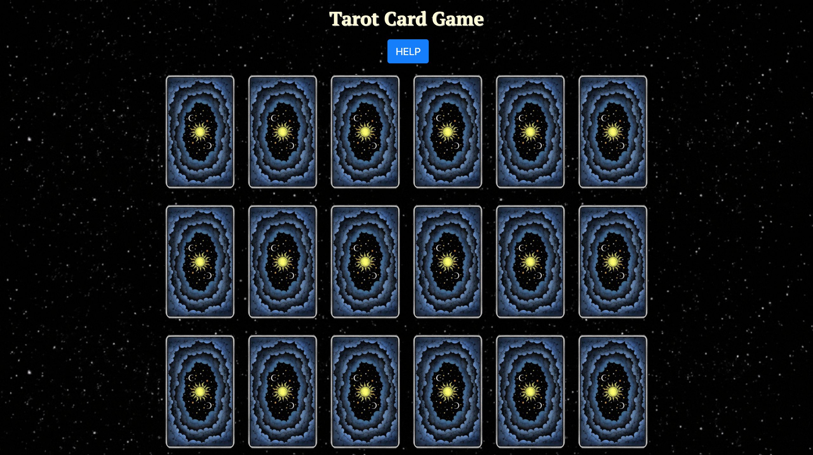
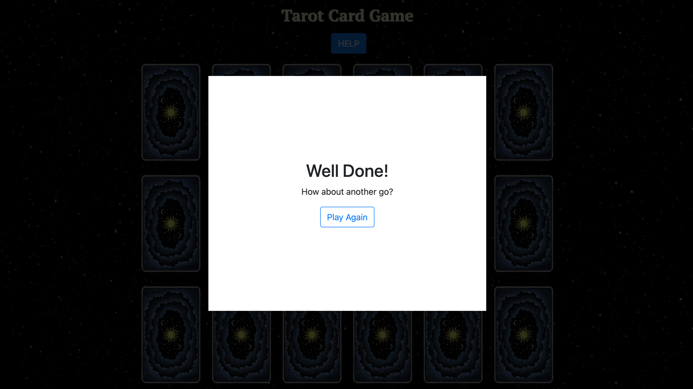
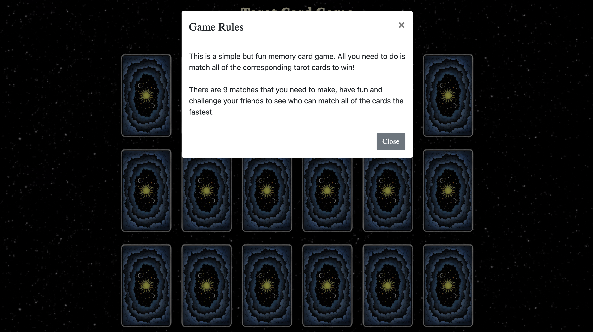

# Tarot Card Game

## Contents

<ul>
<li><a href="#about">About</a></li>
<li><a href="#installation">Installation</a></li>
<li><a href="#usage">Usage</a></li>
<li><a href="#about-the-game">About the Game</a></li>
</ul>

## About

This is a simple but fun memory card game. All you need to do is match all of the corresponding tarot cards to win!

There are 9 matches that you need to make, have fun and challenge your friends to see who can match all of the cards the fastest.

## Installation

if you do not have it, install Node.js;
 
Once you have downloaded the project files, change to the app directory:

```cd memory-game-app```

then install the necessary modules by running:

```npm install```

then once the app has installed the necessary modules, view the app by running:

```npm start```

## Usage

This game is very simple to play, just click on the cards, they will then flip over. The goal is to match all 9 pairs of the tarot cards.

If you click on a card that has already been clicked, it will turn back over. When you match a pair, they will stay facing up. Once you have matched all of the 
pairs, you will get a message congragulating you, and you will have the option to play again.

If you need any help, simply press the "HELP" button at the top of the screen.







## About the game

The app was built using:
* [React](https://reactjs.org/)
* [Bootstrap](https://getbootstrap.com)

## Contact

Liam Volschenk - liamvolschenk@gmail.com